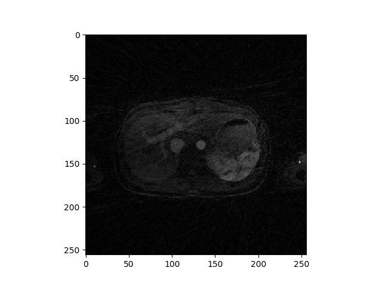

# XDGRASP_Python

<h3> Multi-Coil NUFFT (based of Jeff Fessler NUFFT package) for undersampled radial Liver reconstruction (Python based algorithm) </h3>
  

<h3> Python based XDGRASP undersampled radial Liver MRI reconstruction </h3>
